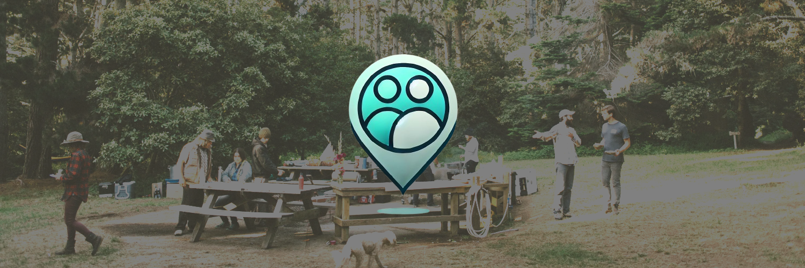

# PlanMatch

[¡Explora más sobre PlanMatch aquí!](https://gust4v0ccam4.github.io/Human-ComputerInteraction/)

## Integrantes
- Gustavo Alonso **CCAMA MARRON**
- Luciana Julissa **HUAMAN COAQUIRA**
- Kevin Joaquin **CHAMBI TAPIA**
- Juan Diego **HUAMANI VILCA**

## Anexos 📝📸
Toda la evidencia está adjunta en los siguientes links:

- [Entrevista el experto 🧠](https://drive.google.com/file/d/1cTA-eVYf8Svn090DlSwFkUz40RRN7_N7/view?usp=sharing)

### Needfinding

- [Entrevista con usuario A](https://drive.google.com/file/d/1p0ZHO1o-LgKMAIPDpoxih7rKc0lplDrg/view)
- [Entrevista con usuario B](https://drive.google.com/file/d/1edEd8Nqt5EGq7nSLjDN-AWy1vRwULkIB/view?usp=sharing)
- [Entrevista con usuario C](https://drive.google.com/file/d/1cTA-eVYf8Svn090DlSwFkUz40RRN7_N7/view?usp=sharing)
- [Entrevista con usuario D](https://drive.google.com/file/d/1cTA-eVYf8Svn090DlSwFkUz40RRN7_N7/view?usp=sharing)